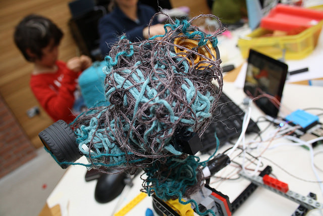

# Setup for tanglebots workshop

Tanglebots are prototype weaving robots -
[for more info see here](http://fo.am/tanglebots).

Parts used:

  * [Raspberry Pi 2 Model B](https://www.raspberrypi.org/products/raspberry-pi-2-model-b/)
  * [Pimoroni Explorer Hat](https://shop.pimoroni.com/products/explorer-hat)
  * [Raspberry Pi Touch Display](https://www.raspberrypi.org/products/raspberry-pi-touch-display/)
  * Small USB keyboard
  * [Microswitches](http://uk.rs-online.com/web/p/microswitches/0515690/) (other suppliers exist)
  * [Small motors](http://uk.rs-online.com/web/p/dc-motors/2389692/)
  * Second hand lego from EBay
  * Second hand/broken electronic toys (e-waste)
  * Lots of yarn
  * A box of materials from the [Cornwall Scrap Store](http://www.cornwallscrapstore.co.uk/)

Some colour printed [tanglebots for beginners](guide/guide.md) guides.

This repository includes Scratch code for access to [Pimoroni Explorer
Hat](https://shop.pimoroni.com/products/explorer-hat) capacitive touch buttons from scratch (as sensors).

Install: 

- Get the pimoroni explorer hat python api: `curl get.pimoroni.com/explorerhat | bash`

Really it only now depends on the python capxxx lib for the buttons that this installs, but the rest is good to have anyway.
Link to the github for that: https://github.com/pimoroni/explorer-hat

Copy tanglebots scratch stuff:
- `sudo mkdir /opt/scratch_tanglebots`
- `sudo cp scratch/* /opt/scratch_tanglebots/`
- `cp scratch/tanglebots.sb  /home/pi/Documents/Scratch\ Projects/`
- `cp scratch_tanglebots.desktop /home/pi/Desktop`

Debugging 
- test the example script it loads automatically
- run /opt/scratch_tanglebots/scratch_tanglebots.sh in a console to see output from python
